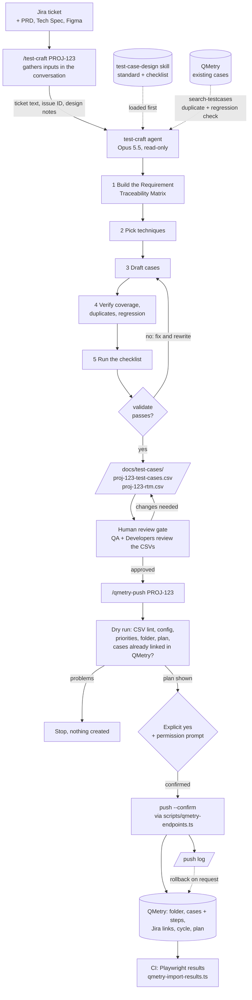
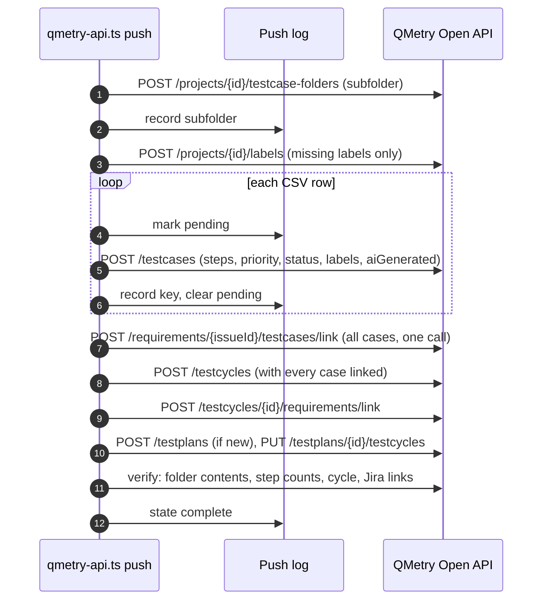

# QA Agents for QMetry

Claude Code agents, commands, and skills that turn Jira tickets into reviewed test cases, push them into QMetry Test Management for Jira, and record automated Playwright results against them.

Any team can use it: clone the repository, add a QMetry token to `.env`, run `/qa-setup` to create `qa.config.json`, and run `npm run doctor`. Both files are gitignored, so no team's settings or tokens are ever committed. Examples use the placeholder ticket key `PROJ-123`.

## Contents

- [Workflow](#workflow)
- [What's in it](#whats-in-it)
- [Setup](#setup)
- [Usage](#usage)
- [Playwright results in CI](#playwright-results-in-ci)
- [Troubleshooting](#troubleshooting)
- [Repository layout](#repository-layout)
- [Known limitations](#known-limitations)

## Workflow



What `push --confirm` does, in order. The push log is written after every create, so an interrupted push resumes where it stopped instead of duplicating anything:



## What's in it

| Piece | What it does |
|---|---|
| `/qa-setup` command | Creates `qa.config.json` from `qa.config.example.json` and fills it with live values: Jira site and project from the Atlassian MCP; QMetry project, priorities, statuses and folders from `scripts/qmetry-api.ts` |
| `/test-craft` command + `test-craft` agent | Pulls a Jira ticket (and its linked Figma design), builds the Requirement Traceability Matrix, designs test cases, checks QMetry for duplicates, runs the review checklist and `validate`, and writes two CSVs to `docs/test-cases/` |
| `test-case-design` skill | The test case standard: coverage tiers, techniques, CSV format, review checklist |
| `/qmetry-push` command + `qmetry-push` skill | Pushes reviewed test cases into QMetry: subfolder, test cases with steps and labels, Jira links, test cycle, test plan. Dry run first, a push log throughout, verification at the end, rollback on request |
| `sprint-qa-plan` skill | Generates the Sprint QA Planning & Sign-off document in `docs/qa-planning/` |
| `scripts/qmetry-endpoints.ts` | The QMetry Open API as typed functions, one per endpoint (`testCases.create`, `requirements.linkTestCases`, `testPlans.unlinkTestCycles`, ...), over one transport with auth, timeouts and safe retries |
| `scripts/qmetry-api.ts` | The CLI behind `/qa-setup` and `/qmetry-push`: doctor, lookups, `search-testcases`, `testcase`, `validate`, push, verify, rollback |
| `scripts/config.ts` | Loads `qa.config.json` and checks it against `qa.config.schema.json` |
| `scripts/qmetry-import-results.ts` | CI step that imports Playwright results into an existing QMetry test cycle |

### How it stays safe

| Control | How |
|---|---|
| Humans approve before anything reaches QMetry | Drafts are always `Draft`. The push needs a dry run, the user's explicit yes, and a Claude Code permission prompt (`ask` rules in `.claude/settings.json`) |
| The drafting agent doesn't change QMetry | It is instructed to run only read-only commands, and any push, rollback or folder create hits the permission prompt |
| Drafts meet the standard | `validate` lints both CSVs (format, fields, traceability, no real hosts or credentials). The agent must pass it, and the push refuses a file that fails it |
| No double push | The push log blocks a repeat on the same machine, and the dry run asks QMetry whether the ticket already has linked cases, which catches a push from another machine |
| No duplicates from retries | Writes are retried only on HTTP 429 (rejected, not processed). Any other failure stops the push, and the resume looks up the half-finished create instead of repeating it |
| Provenance | Pushed cases carry QMetry's `aiGenerated` flag, and the push log records the reviewer, the CSV's SHA-256, and who ran the push |
| Secrets stay out of the conversation | `.env` is gitignored and denied to Claude; the scripts load it themselves and never print it |
| Files Claude doesn't read | Claude Code has no `.claudeignore`; the `deny` rules in `.claude/settings.json` do that job. They hide `.env`, `node_modules/`, `package-lock.json`, `.DS_Store` and `docs/audit/`, and stop hand edits to push logs. To hide something else, add a `Read(./path/**)` rule there |

## Setup

What one person does once per machine. Budget 20 minutes, most of it waiting for access. Anything that differs per team lives in two files, neither of them committed: `qa.config.json` (settings) and `.env` (tokens).

### 1. Check the prerequisites

| Need | Check | If missing |
|---|---|---|
| Node.js 22.18 or newer | `node --version` | Install from nodejs.org, or `nvm install 22`. Node runs the scripts' TypeScript directly; no packages are needed to run them |
| Claude Code | `claude --version` | https://claude.com/claude-code |
| Jira access | You can open a ticket in the project, and link issues | Ask your Jira admin |
| QMetry enabled on the project | The QMetry tab shows in Jira. For pushing: create and delete rights on test cases, folders, labels, cycles and plans, and the ticket's issue type enabled as a requirement | Ask your Jira or QMetry admin |

### 2. Clone

```bash
git clone <this repository> qa-agents
cd qa-agents
npm install     # optional: type definitions, only needed for npm run typecheck
```

### 3. Connect Jira (and Figma) to Claude Code

Once per machine:

```bash
claude mcp add --transport http --scope user atlassian https://mcp.atlassian.com/v2/mcp
```

Start Claude Code in the repository, run `/mcp`, and log in to Atlassian. It is used to read tickets, resolve the numeric issue ID for links, and read PRD or Tech Spec pages in Confluence.

If your tickets link designs, add the Figma plugin and log in the same way. Figma only lets connected tools read files owned by a team the logged-in account belongs to; if a design can't be read, export the frames as a PDF and pass it with `--figma <path>`.

QMetry is reached through its REST API by the scripts, not through an MCP server.

### 4. Add the QMetry API keys

In Jira: **QMetry, Configuration, Open API, Generate**, and copy the key. For importing automated results, also generate a key under **QMetry, Automation & CI/CD, Automation API**.

```bash
cp .env.example .env
chmod 600 .env
```

Open `.env` in your editor and set `QTM_API_TOKEN=` to the Open API key (and `QTM_AUTOMATION_API_KEY=` if you have one). Never paste a key into a Claude conversation; the scripts read `.env` themselves, and `.claude/settings.json` stops Claude from reading it.

### 5. Create qa.config.json

In Claude Code, in the repository:

```
/qa-setup PROJ-123
```

The ticket key is optional; any ticket from your team's project confirms the Jira project. `/qa-setup` copies `qa.config.example.json` to `qa.config.json`, then replaces the placeholders with live values:

| Values | Read from |
|---|---|
| `jira.site`, `jira.projectKey` | The Atlassian MCP: your accessible sites, and the project of the ticket you give (or a list to pick from) |
| `qmetry.projectKey` | `node scripts/qmetry-api.ts projects`: the QMetry-enabled projects your key can see |
| `qmetry.priorityMap`, `qmetry.caseStatus` | `node scripts/qmetry-api.ts meta`: your project's real priorities and test case statuses |
| `qmetry.mainFolder` | `node scripts/qmetry-api.ts folders`: your real test case folders |
| `team.name`, `testCases.defaultTier` | Asked |

It proposes every value, asks once for confirmation, writes the file, and runs `doctor` on it. Run it again later to change a setting.

To do it by hand instead: `cp qa.config.example.json qa.config.json` and edit the values. The `$schema` line points at `qa.config.schema.json`, so editors such as VS Code autocomplete each field, show its description, and flag a wrong value. The scripts check the same schema: an unknown key, or a missing `jira` or `qmetry` section, stops them with a message naming the key.

| Setting | Effect |
|---|---|
| `team.name`, `team.documentRole` | Shown in generated documents. The role defaults to `Developers` |
| `jira.site`, `jira.projectKey` | Which Jira site and project the commands assume |
| `qmetry.baseUrl` | Your QMetry region. `https://qtmcloud.qmetry.com/rest/api/latest` by default; `https://syd-qtmcloud.qmetry.com/rest/api/latest` for Australia. `QTM_API_BASE_URL` overrides it |
| `qmetry.projectKey` | The QMetry project pushed to. Usually the same as the Jira key |
| `qmetry.priorityMap` | Turns the CSV's `High`, `Normal` and `Low` into priorities your project defines. Most projects have no `Normal`, so map it to `Medium` |
| `qmetry.caseStatus` | The status a pushed case gets, for example `Done`. `null` leaves the project default |
| `qmetry.labels` | Whether a push creates labels for the ticket key, category, technique and level |
| `qmetry.mainFolder` | The folder pushes go under, for example `Sprint_26`. `null` means you are asked every push |
| `qmetry.markAiGenerated` | Sets QMetry's AI-generated flag on every pushed case (default `true`) |
| `testCases.defaultTier` | Coverage tier when `/test-craft` is run without one: `smoke`, `critical` or `full` |

### 6. Check everything

```bash
npm run doctor
```

It reports the Node version, your config, whether the token works, your project's real priorities and statuses, and whether the config's mapping and folder exist. `"ok": true` means you're ready. Anything under `problems` has to be fixed ([Troubleshooting](#troubleshooting) explains each message); `notes` are advisory.

### 7. Try it end to end

1. Draft cases for a small ticket: `/test-craft PROJ-123 smoke`
2. Read `docs/test-cases/proj-123-test-cases.csv` and fix anything wrong. This is the review gate, not a formality.
3. Push them: `/qmetry-push PROJ-123`. It runs a dry run first, shows the plan, and waits for your yes.
4. Check the cases in QMetry, then try `/qmetry-push PROJ-123 rollback` on a throwaway ticket to see the undo path before you need it.

### What is and isn't committed

| Committed | Not committed (gitignored) |
|---|---|
| `.claude/`, `scripts/`, `qa.config.example.json`, `qa.config.schema.json`, `.env.example`, `README.md`, `CLAUDE.md` | `qa.config.json` and `.env`: each teammate runs `/qa-setup` once and adds their own key |
| | `docs/`: drafted CSVs, push logs and sprint plans stay on the machine that made them |

Each teammate needs only: clone, `cp .env.example .env`, add their own QMetry key, run `/qa-setup`, then `npm run doctor`.

Because push logs are local, resume and rollback must run on the machine that did the push. Keep `docs/test-cases/` until a push is complete and you're sure you won't need to roll it back.

| Safe to change | Leave alone |
|---|---|
| `qa.config.json` | `.claude/skills/test-case-design/` unless your QA standard really differs, since the CSV format is tied to the push script |
| Coverage tier defaults, folder naming | The CSV header: `scripts/qmetry-api.ts` and the push skill parse it (the "CSV columns change" checklist in `CLAUDE.md` lists every place) |
| Your own commands under `.claude/commands/` | Push logs in `docs/test-cases/`, which resume and rollback need |

## Usage

### Draft test cases

```
/test-craft PROJ-123 critical --prd <path or link> --spec <path or link> --figma <link or exported PDF>
```

- Coverage tier is `smoke`, `critical` (the default, from `testCases.defaultTier`), or `full`.
- Output: `docs/test-cases/proj-123-test-cases.csv` (one row per case, with steps, test data and expected results as matching numbered lines) and `docs/test-cases/proj-123-rtm.csv`.
- Every drafted case is `Draft`. QA reviews the CSVs, and Developers check technical accuracy, before anything goes into QMetry.
- Duplicates are checked against QMetry only, through the read-only search. Local CSVs of other tickets are not read, since they may be unreviewed drafts.
- The agent runs on a pinned model (`claude-sonnet-5`, `effort: high`) so every teammate's drafts come from the same model. `CLAUDE.md` explains when to change it.

### Push reviewed test cases into QMetry

```
/qmetry-push PROJ-123
```

- Reads the QMetry project, then asks in one round for the reviewer, main folder, subfolder and cycle name, approved status, any missing priority mapping, and the test plan. Values in `qa.config.json` are offered as defaults.
- Runs a dry run that creates nothing, shows the plan, and waits for your yes. Claude Code asks permission for both the dry run and the push.
- Stops if QMetry already has cases linked to the ticket, unless you confirm adding to them (`--allow-existing`).
- If it stops partway, run the same command again: it resumes from the push log.
- Undo: `/qmetry-push PROJ-123 rollback` shows what would be deleted (cases, cycle, the plan if the push created it, subfolder; never labels) and deletes only after you confirm.

### The CLI directly

`--project` defaults to `qmetry.projectKey`. `npm run qmetry -- <command>` works too.

```bash
node scripts/qmetry-api.ts doctor                                    # config, token, project values
node scripts/qmetry-api.ts projects                                  # QMetry-enabled projects (works before qa.config.json exists)
node scripts/qmetry-api.ts meta                                      # priorities, statuses, label count
node scripts/qmetry-api.ts folders                                   # test case folders with full paths
node scripts/qmetry-api.ts plans                                     # test plans
node scripts/qmetry-api.ts search-testcases --text "login" --limit 20    # existing cases by key/summary
node scripts/qmetry-api.ts search-testcases --issue-id 13210         # cases linked to a ticket
node scripts/qmetry-api.ts testcase --key PROJ-TC-3                  # one case with its steps
node scripts/qmetry-api.ts validate --ticket PROJ-123                # lint the CSVs, no network
node scripts/qmetry-api.ts create-folder --name Sprint_27 --root
node scripts/qmetry-api.ts push --ticket PROJ-123 --issue-id 13210 --reviewer "Name" --name PROJ-123 \
     --folder Sprint_27 --new-plan "Sprint 27"                       # dry run
node scripts/qmetry-api.ts push ... --confirm                        # the push
node scripts/qmetry-api.ts verify --ticket PROJ-123                  # re-check a pushed ticket
node scripts/qmetry-api.ts rollback --ticket PROJ-123                # list what a rollback would delete
```

Output is JSON on stdout, progress on stderr. `QTM_DEBUG=1` traces every API call (method, path, status, time) without the key. The API reference is at https://app.swaggerhub.com/apis-docs/qmetry-ada/qtm4j_cloud/restapi; the instance-wide rate limit is 10,000 calls an hour, and the scripts back off and honor `Retry-After`.

### Sprint QA plan

Ask Claude to "create a sprint QA plan for sprint 24". It writes `docs/qa-planning/sprint-24-qa-planning.md`, and updates it in place later in the sprint.

## Playwright results in CI

Record each Playwright result against its QMetry test case, in an existing test cycle, from any CI system.

1. `/qmetry-push PROJ-123` creates the cases (`PROJ-TC-3`, ...) and the cycle (`PROJ-TR-2`).
2. Each Playwright test is tagged with its QMetry key or CSV ID.
3. CI runs Playwright, which writes `results.json`.
4. `scripts/qmetry-import-results.ts` turns it into a JUnit file keyed by QMetry key and imports it into the cycle, which then shows Pass or Fail per case with the build and environment.

A conversion step is needed because QMetry matches results by a `testcasekey` attribute on each JUnit `<testsuite>`, which Playwright's own JUnit reporter doesn't write; a direct upload would match by title and create duplicates. The import uses `automationHierarchy 1` (one suite per test case), `testCycleToReuse` (the existing cycle), and `matchTestSteps false` (the case is used as is).

### One-time setup

1. **Key.** Store the Automation API key (step 4 of Setup) as a CI secret named `QTM_AUTOMATION_API_KEY`. The script falls back to `QTM_API_TOKEN`. For the Australia region, also set `QTM_AUTOMATION_BASE_URL=https://syd-qtmcloud.qmetry.com/rest/api/automation`.
2. **Script.** It is a single dependency-free file (Node 22.18+). If the Playwright tests live in another repository, copy `scripts/qmetry-import-results.ts` there (for example to `tools/`), plus the push log if tests are tagged with CSV IDs.
3. **Reporter.** Add the JSON reporter in `playwright.config.ts`, keeping any others:

   ```ts
   reporter: [["list"], ["html", { open: "never" }], ["json", { outputFile: "test-results/results.json" }]],
   ```

### Tagging tests

Pick one form per project:

```ts
test("deactivate dialog shows title and buttons", { tag: "@PROJ-TC-3" }, async ({ page }) => {});   // QMetry key (recommended)
test("deactivate dialog shows title and buttons", { tag: "@TC-POS-01" }, async ({ page }) => {});   // CSV ID, needs --push-log
test("deactivate dialog shows title and buttons", {
  annotation: { type: "qmetry", description: "PROJ-TC-3" },                                        // annotation
}, async ({ page }) => {});
```

- One test can cover several cases (give it several tags); several tests can cover one case (for example across browsers), and the case fails if any of them fails.
- An untagged test stops the import, so nothing is silently left out. `--allow-unmapped` allows helper tests.
- Results: passed is Pass; failed, timed out or interrupted is Fail with the error; flaky (passed on retry) is Pass with a note; skipped is marked skipped (confirm how your project displays it on the first import).

### Running it

Dry run first; it converts and writes `qmetry-junit.xml` without contacting QMetry:

```bash
npx playwright test
node scripts/qmetry-import-results.ts --report test-results/results.json --cycle PROJ-TR-2 \
  --push-log docs/test-cases/proj-123-qmetry-push.json --dry-run
```

Then run the same command without `--dry-run`.

| Option | Purpose |
|---|---|
| `--report <file>` | Playwright JSON report (required) |
| `--cycle <key>` | QMetry test cycle, for example `PROJ-TR-2` (required) |
| `--push-log <file>` | Maps CSV IDs to QMetry keys, when tests are tagged with CSV IDs |
| `--environment <name>`, `--build <name>` | Shown on the execution in QMetry |
| `--story <Jira key>` | Also links the cases to this story |
| `--out <file>` | JUnit output path (default `qmetry-junit.xml`) |
| `--allow-unmapped`, `--allow-new-cases` | Don't stop on untagged tests, or on newly created cases |
| `--timeout <seconds>` | How long to wait for QMetry to process (default 600) |
| `--dry-run` | Convert only |

Test failures don't change the exit code (Playwright's step already fails the pipeline). The import step must run **even when tests fail**.

### CI examples

GitHub Actions:

```yaml
- name: Run Playwright
  run: npx playwright test
- name: Import results into QMetry
  if: always()
  env:
    QTM_AUTOMATION_API_KEY: ${{ secrets.QTM_AUTOMATION_API_KEY }}
  run: >
    node tools/qmetry-import-results.ts --report test-results/results.json
    --cycle "${{ vars.QMETRY_CYCLE }}" --environment Staging --build "${{ github.sha }}"
```

GitLab CI (add `QTM_AUTOMATION_API_KEY` as a masked variable):

```yaml
e2e:
  script:
    - npm ci
    - npx playwright test
  after_script:
    - node tools/qmetry-import-results.ts --report test-results/results.json --cycle "$QMETRY_CYCLE" --environment Staging --build "$CI_COMMIT_SHORT_SHA"
```

Jenkins:

```groovy
environment { QTM_AUTOMATION_API_KEY = credentials('qtm-automation-api-key') }
post {
  always {
    sh 'node tools/qmetry-import-results.ts --report test-results/results.json --cycle "$QMETRY_CYCLE" --environment Staging --build "$BUILD_NUMBER"'
  }
}
```

Keep the cycle key in a CI variable (`QMETRY_CYCLE`), not in the workflow file, so moving to the next sprint's cycle is a settings change. Use one cycle per ticket, or add each ticket's cases to a shared sprint cycle in QMetry and point the pipeline at that.

## Troubleshooting

Start with `npm run doctor`. Output is always JSON, with the message under `error` or `problems`.

| Exit code | Meaning |
|---|---|
| 0 | Success |
| 1 | A call failed, or verification found a problem |
| 2 | The token is missing, or `qa.config.json` is unusable |
| 3 | A check failed before anything was created |
| 5 | Result import only: QMetry created new test cases, so a tag didn't match |

Nothing is ever created on exit codes 2 or 3.

### Setup and config

| Message | Fix |
|---|---|
| `QTM_API_TOKEN is not set` | `cp .env.example .env`, then add your Open API key, unquoted |
| `qa.config.json not found` | Run from the repository root, or run `/qa-setup` |
| `"qmetry.caseStatu" is not a setting in qa.config.schema.json` | A misspelled or unknown key. `qa.config.example.json` lists every valid key |
| `"jira" is required` | A required section was removed; copy it back from `qa.config.example.json` |
| `qa.config.json is not valid JSON` | A trailing comma or missing quote; your editor will point at it |
| `"jira.projectKey" is still the placeholder PROJ` (a note) | Run `/qa-setup` to fill in real values |
| `--project is required` | No `qa.config.json` yet, so pass `--project <KEY>` or run `/qa-setup` |
| `Node <version> is too old` | Upgrade to Node 22.18 or newer |

### Reaching QMetry

| Message | Fix |
|---|---|
| `HTTP 401` | Wrong or revoked key: generate a new Open API key and update `.env`. Outside the US, check `qmetry.baseUrl` |
| `HTTP 403` | Your account lacks a permission; ask your QMetry admin |
| `Project PROJ not found, or QMetry is not enabled for it` | Check `qmetry.projectKey` (`projects` lists the valid ones), or ask an admin to enable QMetry |
| `HTTP 429` | The instance-wide 10,000 calls an hour limit is exhausted. Wait; a stopped push resumes with the same command |
| `The operation was aborted due to timeout` | Network, VPN or a slow instance. Retry (60 seconds per call) |

### Before a push (exit code 3, nothing created)

| Message | Fix |
|---|---|
| `CSV not found` | Run `/test-craft <ticket-id>` first |
| `CSV standard: ...` or a `validate` problem | Fix what it names (the code, such as F7 or H3, is the checklist item), then have it re-reviewed |
| `CSV header does not match the test-case-design standard` | Restore the header; columns are parsed by name and order |
| `line N of "Steps" does not start with "N. "` / `step cells have different line counts` | Every step needs a numbered line, from 1 without gaps, in Steps, Step Test Data and Step Expected Results |
| `Priority "X" (CSV "Y") not in QMetry` | Fix `qmetry.priorityMap`, or pass `--priority-map Y=RealName`. `doctor` lists the real ones |
| `Test case status "X" not in QMetry` | Fix `qmetry.caseStatus`. Many projects have no `Approved` |
| `Main test case folder not found` | `node scripts/qmetry-api.ts create-folder --name Sprint_27 --root` |
| `Folder "X" matches several folders` | Pass `--folder-id` with the ID from `folders` |
| `Folder "A/B" already exists and this push did not create it` | Use another subfolder name, or remove the leftover folder in QMetry |
| `<ticket> already has N test case(s) linked in QMetry` | Someone may have pushed it from another machine. Check the listed keys; `--allow-existing` only if adding to them is intended |
| `Test plan X not found` / `A test plan named "X" already exists` | Use a key from `plans`, or `--plan <key>` for the existing one |
| `Already pushed: ... is complete` | Change the cases in QMetry, or roll the push back first |
| `... records a rollback` | Move that push log aside, then push again |
| `The CSV changed after this push started` | Restore the CSV to resume, or roll back and push the new version |

### During a push, rollback, and imports

| What you see | What to do |
|---|---|
| `create test case (TC-POS-03) failed: ...`, exit 1 | Re-run the **same** `push --confirm`. It resumes and looks up any half-finished create |
| A resume fails on the same step twice | Stop, read `failures` in the push log, and fix the cause |
| `Subfolder holds X, which this push did not log` | Someone added cases to the folder. Check it; the push stays `in_progress` until verification passes |
| `<ID> (KEY) has N steps in QMetry, CSV has M` | Steps were edited on one side. Fix in QMetry, or roll back and push the corrected CSV |
| `No push log at ...` | Nothing to roll back from this machine. Push logs are local, so run rollback where the push ran, or delete the cases in QMetry by hand |
| `failed` entries in a rollback | Often a permission. Fix it and run the rollback again; finished deletes are skipped |
| Import exit 3 with `unmappedTests` | Tag the tests, or pass `--push-log` for CSV ID tags |
| Import exit 5, `testCasesCreated` above 0 | A tag didn't match a case in the cycle. Fix it and delete the stray case QMetry created |
| Import `upload returned HTTP 403` | The upload link expired; re-run the step |
| `Import not finished after Ns` | Check QMetry, Automation & CI/CD, History, or raise `--timeout` |

## Repository layout

```
.claude/
  agents/test-craft.md            drafting workflow (model and tools in the frontmatter)
  commands/qa-setup.md            /qa-setup (creates qa.config.json)
  commands/test-craft.md          /test-craft
  commands/qmetry-push.md         /qmetry-push
  skills/test-case-design/        test case standard and review checklist
  skills/qmetry-push/             CSV to QMetry mapping, checks, push log, resume, rollback
  skills/sprint-qa-plan/          sprint QA planning document
  settings.json                   permissions (the ignore list): .env and noise denied, pushes ask, read-only commands allowed
scripts/
  qmetry-endpoints.ts             QMetry Open API, one typed function per endpoint
  qmetry-api.ts                   CLI: doctor, lookups, search, validate, push, verify, rollback
  config.ts                       loads qa.config.json and checks it against the schema
  qmetry-import-results.ts        Playwright results into a QMetry test cycle (CI)
qa.config.example.json            the template /qa-setup copies to qa.config.json
qa.config.schema.json             what each setting means and accepts
.env.example                      template for .env
docs/                             generated output, gitignored (test cases, push logs, sprint plans)
```

## Known limitations

- QMetry projects often have no `Approved` status or `Normal` priority, so CSV values are mapped at push time through `qa.config.json`.
- Text search in QMetry covers test case key and summary, not steps, so the duplicate check can miss a case worded differently. The agent opens likely matches to compare steps.
- Push logs are local, so resume and rollback only work on the machine that pushed.
- Tested against a mock server built from the QMetry specification, not yet against live QMetry: resuming an interrupted push, `rollback --confirm`, the `aiGenerated` flag, the already-linked check, and the Playwright result import.
- Who pushed is recorded as the operating system user, not a verified Atlassian identity.
